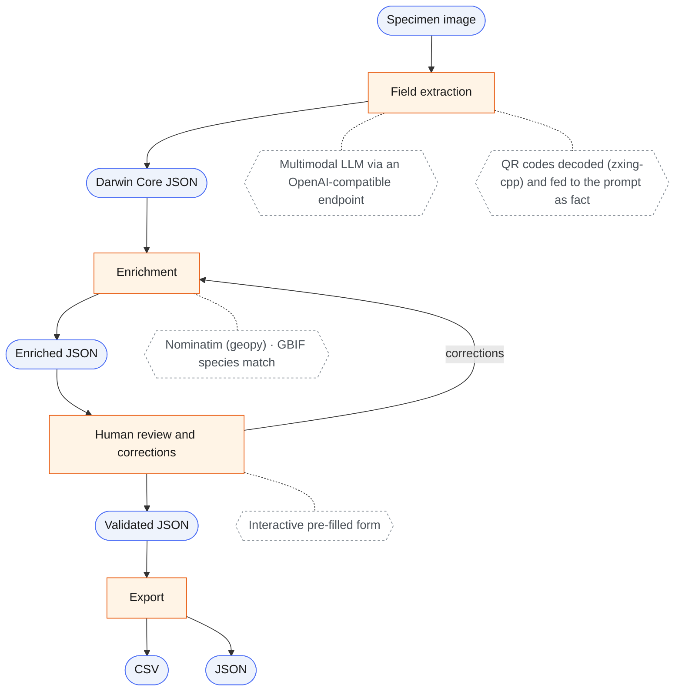

<p align="center">
  
</p>

<h1 align="center">
  speciai
</h1>
<p align="center">
</p>

[](https://github.com/sdsc-ordes/speciai/releases/latest)
[](https://github.com/sdsc-ordes/speciai/actions/workflows/normal.yaml)
[](https://mit-license.org/)

**Authors:**

- [Martin Fontanet](mailto:martin.fontanet@epfl.ch)
- [Cyril Matthey-Doret](mailto:cyril.matthey-doret@epfl.ch)
- [Robin Franken](mailto:robin.franken@epfl.ch)

# Insect specimen digitization

Ingests images of specimen with various human-written labels to produce
structured [Darwin Core](https://dwc.tdwg.org/) records.



## Stages

| #   | Stage        | Tool / model                           | Output                    |
| --- | ------------ | -------------------------------------- | ------------------------- |
| 1   | Extraction   | Multimodal LLM (OpenAI-compatible API) | Darwin Core–keyed JSON    |
| 2   | Enrichment   | Nominatim (geopy), GBIF species match  | Authority-resolved values |
| 3   | Human review | Interactive pre-filled form            | Confirmed / edited record |

## Infrastructure

- **Storage**: S3 with prefixes `images/` and `models/`
- **Compute**: local only (CPU, 16GB RAM)
- **Secrets**: `.env` encrypted with `age` + `sops`. Covers S3 credentials and
  API tokens.

## Open Questions

- [x] Validate `doctr` on real label images.
- [x] Benchmark Gemma 4 vs. fine-tuned BERT for zero-shot Darwin Core field
      classification.
- [ ] Confirm output format requirements (json-ld or plain Darwin Core JSON)
- [x] Identify relevant sources for enrichment.
- [ ] Should we use a workflow manager (metaflow, temporal) to connect steps.

## Extraction model

The `extract` and `serve` commands read specimen images through an
OpenAI-compatible chat-completions endpoint. The model must be multimodal -- it
reads the label pixels directly, with no OCR step. There is no in-process model:
to run one locally, serve it yourself (vLLM, llama.cpp, Ollama) and point
`--llm-base-url` at it.

    uv run speciai extract --model Qwen/Qwen3.8-27B-fp8 specimen.jpg

### Configuration

Every option takes a flag or an environment variable, which `.env` can supply.
The flag wins, then the variable, then the default -- so a deployment configures
the endpoint once instead of on every invocation. An empty variable counts as
unset.

| Flag             | Variable          | Default                            |
| ---------------- | ----------------- | ---------------------------------- |
| `--llm-base-url` | `LLM_BASE_URL`    | `https://inference-rcp.epfl.ch/v1` |
| `--model`        | `LLM_MODEL`       | none, and required                 |
| (none)           | `LLM_API_KEY`     | unset                              |
| `--thinking`     | `LLM_THINKING`    | `off`                              |
| `--temperature`  | `LLM_TEMPERATURE` | `0.0`                              |

The API key has no flag on purpose: a key in `argv` lands in the shell history
and in every process listing on the machine.

`--thinking off|on|none` sets vLLM's `enable_thinking`. It defaults to `off`,
which is how every run in `runs/` was scored: a reasoning trace multiplies
latency per image and buys nothing when the reply is a fixed schema. `none`
sends no such field at all, for a provider that rejects one it does not define.

`--temperature none` omits the temperature parameter entirely, for a model that
refuses to be told. Zero is the default because it is what makes a run
reproducible.

### Providers

Anything speaking the OpenAI chat-completions API with `response_format`
JSON-schema structured outputs works. Verified request shapes:

| Provider          | `LLM_BASE_URL`                                            | Extra settings               |
| ----------------- | --------------------------------------------------------- | ---------------------------- |
| EPFL RCP          | `https://inference-rcp.epfl.ch/v1`                        | none, this is the default    |
| Anthropic         | `https://api.anthropic.com/v1`                            | `LLM_TEMPERATURE=none`       |
| OpenAI            | `https://api.openai.com/v1`                               | `LLM_THINKING=none`          |
| Gemini            | `https://generativelanguage.googleapis.com/v1beta/openai` | `LLM_THINKING=none`          |
| Local vLLM/Ollama | `http://localhost:8000/v1`                                | `LLM_API_KEY` often unneeded |

Two provider-specific request fields are worth knowing about, because a wrong
one is an HTTP 400 and not a bad record.

`temperature`: the Claude models reject it outright ("`temperature` is
deprecated for this model"), hence `LLM_TEMPERATURE=none`. Every other provider
here accepts it.

`chat_template_kwargs`, which carries the thinking toggle: it is a vLLM
extension. Anthropic's endpoint ignores it, verified 2026-08-28 by a request
that passed validation with the field present. OpenAI and Gemini reject
unrecognised body fields as a rule, which is what `LLM_THINKING=none` is for;
that has not been confirmed against either service with a live key.

An endpoint without structured-output support (some llama.cpp and Ollama builds)
will fail at the parse step. Nothing in the pipeline works around that yet.

## QR codes

Any QR code pinned with the specimen is decoded (zxing-cpp) before stage 1. A
curator typed the payload in, so it outranks both the model's reading of the
label and the enrichment lookups. Two codes on one image are both read, in
reading order, and an image without one changes nothing. Only QR codes are read:
a linear accession barcode states something else and must not be passed off as
QR data.

A payload comes in one of two shapes.

**A structured record**, holding Darwin Core fields under short keys:

```json
{
  "m1p": "[ETHZ Entomology]",
  "m2v": "1.0",
  "f": "Chrysididae",
  "b": "Chrysidinae",
  "t": "Chrysidini",
  "g": "Stilbum",
  "s": "calens",
  "u": "subcalens",
  "a": "Linsenmaier, 1951",
  "id": "Paolo Rosa",
  "idD": "2019",
  "x": "Female"
}
```

These fields are written onto the record after enrichment, replacing whatever
the model read or GBIF matched. The model never sees them.

The composed name is also the name the taxonomic lookup is asked about, in place
of the label's reading. That matters when the two disagree: ask GBIF about a
misread label and then write the curator's name over the answer, and the record
ends up holding a chrysidid wasp in family `Papilionidae` and order
`Lepidoptera`, with nothing to say the two halves describe different animals.
Only `order`, `class`, `kingdom` and `phylum` have no key of their own, so a
complete payload cannot paper over it either.

| Key | Field             | Key   | Field                  |
| --- | ----------------- | ----- | ---------------------- |
| `f` | `family`          | `u`   | `infraspecificEpithet` |
| `b` | `subfamily`       | `id`  | `identifiedBy`         |
| `t` | `tribe`           | `idD` | `dateIdentified`       |
| `g` | `genus`           | `x`   | `sex`                  |
| `s` | `specificEpithet` |       |                        |

`a` (authority) and the name parts compose two more fields, so the example above
yields `scientificName` = `Stilbum calens subcalens (Linsenmaier, 1951)` and
`scientificNameAuthorship` = `Linsenmaier, 1951`. Payloads store the authority
inconsistently, so brackets wrapping the whole of it come off first: a payload
holding `(Muller, 1764)` still yields `Brachytron pratense (Muller, 1764)` and
not a doubled pair. Brackets that are part of the authorship survive, as in
`Ematurga atomaria ([Denis & Schiffermuller], 1775)`.

`m1p` (provider) and `m2v` (schema version) are discarded, unknown keys are
logged and skipped, and a value the schema refuses is dropped on its own rather
than costing the record. No `verbatim*` field is ever touched: the QR code is
not the label.

**Anything else**, such as a bare `ETHZ-ENT0082619`, is appended to the
extraction prompt as data the model must treat as valid.

## Post-processing

Once extraction, enrichment and the QR codes have all had their say, two steps
correct the record. Neither touches the network, so both are cheap and safe to
re-run -- the review form's re-derive does exactly that.

### Rules

`speciai.postprocess.apply_rules` fixes values the pipeline produced. Each fix
is one row in `RULES`, declaring the fields it reads, the field it writes and
the function between them:

| Reads               | Writes           | Fix                                         |
| ------------------- | ---------------- | ------------------------------------------- |
| `countryCode`       | `countryCode`    | uppercase, since ISO 3166-1 alpha-2 is      |
| `countryCode`       | `continent`      | look up the continent                       |
| `decimalLatitude`   | `geodeticDatum`  | `WGS84`, but only with coordinates          |
| `verbatimEventDate` | `eventDate`      | read the label's date, at its own precision |
| `dateIdentified`    | `dateIdentified` | widen to the interval its precision denotes |
| `typeStatus`        | `typeStatus`     | map onto the sheet's vocabulary, or default |

Declaring reads and writes is what makes the table checkable. `validate_rules`
raises at import unless all three hold: no rule writes a `verbatim*` term, every
name is a real field, and no rule reads a value a later rule writes. A property
test then runs 200 generated records through twice and asserts the second pass
changes nothing -- a rule that drifts on re-application would corrupt a record a
little more each time a reviewer pressed re-derive.

A rule returns `None` to mean "no opinion", never "blank it" -- which is how an
unfamiliar type status survives as the label had it.

`postprocess` runs both steps in order and is what `pipeline.run` calls;
`apply_rules` and `apply_constants` are public for a caller that wants one.

`apply_rules` also reports which fields it decided. `pipeline.run` returns that
as `Result.derived`, and the review form badges those fields `Auto-set`, so a
reviewer can tell a value the pipeline worked out from one it read off the
label:

```python
result = run(image, extractor)
result.record    # the DarwinCoreRecord
result.derived   # frozenset of fields post-processing set
```

### Constants

Fields that are the same for every specimen in a collection are set last of all
by `speciai.postprocess.apply_constants`. The defaults are:

| Field     | Value        |
| --------- | ------------ |
| `kingdom` | `Animalia`   |
| `phylum`  | `Arthropoda` |

A constant replaces whatever the pipeline read or matched, since no label or
lookup knows the collection better. A replacement of a value that differed is
logged, because it usually means an identification went wrong further up.

`pipeline.run` takes the mapping as its `constants` argument, so a caller can
set its own fields, or pass `None` to skip the step:

```python
run(image, extractor, constants={"kingdom": "Animalia", "preparations": "pinned"})
run(image, extractor, constants=None)
```

A field name no record has, or a value the schema refuses, raises rather than
landing quietly in every record of the run.

## Web review UI

Install the dependencies and start the server:

    uv sync
    just run serve --model MODEL_ID

`serve` takes the same endpoint options as `extract`, flags or environment
variables (see [Configuration](#configuration)).

Or run it in a container (image: `tools/images/Containerfile`); `./data` is
mounted at `/app/data`. Compose reads the endpoint variables from the
environment or a git-ignored `.env`, and fails fast if `LLM_MODEL` is unset:

    docker compose up             # or: podman compose up / just image::serve

Open http://127.0.0.1:8000, choose a specimen image, watch it go through extract
-> enrich, review the Darwin Core record beside the image, and export it as a
CSV or JSON.

Workflow:

1. **Upload**: Drag or choose an image on the start page.
2. **Progress**: The browser streams live stage updates (extract, enrich) via
   Server-Sent Events. You can leave the page and return.
3. **Review**: Shows the original image alongside the pre-filled Darwin Core
   form. Edit any field before exporting.
4. **Export**: "Export CSV" downloads a Specify-WorkBench-compatible file whose
   column headers are DarwinCore terms. "Export JSON" returns the same record as
   JSON.

## Installation

Describe the installation instruction here.

## Usage

Describe the installation instruction here.

## Development

Read first the [Contribution Guidelines](/CONTRIBUTING.md).

For technical documentation on setup and development, see the
[Development Guide](docs/development-guide.md)

## Acknowledgement

Acknowledge all contributors and external collaborators here.

## Copyright

Copyright © 2026-2028 Swiss Data Science Center (SDSC),
[www.datascience.ch](http://www.datascience.ch/). All rights reserved. The SDSC
is jointly established and legally represented by the École Polytechnique
Fédérale de Lausanne (EPFL) and the Eidgenössische Technische Hochschule Zürich
(ETH Zürich). This copyright encompasses all materials, software, documentation,
and other content created and developed by the SDSC.
