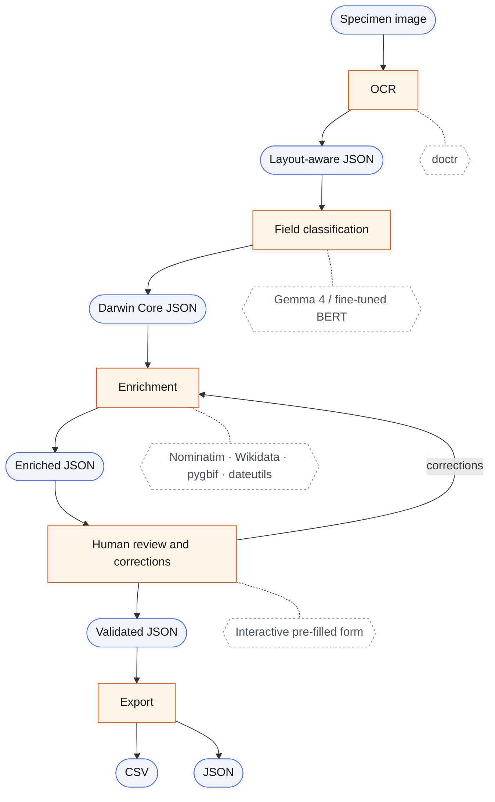

  

<h1 align="center">
  speciai
</h1>

**Authors:**

- [Martin Fontanet](mailto:martin.fontanet@epfl.ch)
- [Cyril Matthey-Doret](mailto:cyril.matthey-doret@epfl.ch)
- [Robin Franken](mailto:robin.franken@epfl.ch)

# Insect specimen digitization

Ingests images of specimen with various human-written labels to produce
structured [Darwin Core](https://dwc.tdwg.org/) records.

## Stages

| #   | Stage          | Tool / model                             | Output                                    |
| --- | -------------- | ---------------------------------------- | ----------------------------------------- |
| 1   | OCR            | `doctr`                                  | Hierarchical JSON preserving label layout |
| 2   | Classification | Gemma 4-E2B-it                           | Darwin Core–keyed JSON                    |
| 3   | Enrichment     | Nominatim, Wikidata, pygbif, `dateutils` | Normalised field values                   |
| 4   | Human review   | Interactive pre-filled form              | Confirmed / edited record                 |

## Infrastructure

- **Storage**: S3 with prefixes `images/` and `models/`
- **Compute**: local only (CPU, 16GB RAM)
- **Secrets**: `.env` encrypted with `age` + `sops`. Covers S3 credentials and
  API tokens.

## Open Questions

- [x] Validate `doctr` on real label images.
- [x] Benchmark Gemma 4 vs. fine-tuned BERT for zero-shot Darwin Core field
      classification.
- [ ] Confirm output format requirements (json-ld or plain Darwin Core JSON)
- [x] Identify relevant sources for enrichment.
- [ ] Should we use a workflow manager (metaflow, temporal) to connect steps.

## Installation

Describe the installation instruction here.

## Usage

Describe the installation instruction here.

## Development

Read first the [Contribution Guidelines](/CONTRIBUTING.md).

For technical documentation on setup and development, see the
[Development Guide](docs/development-guide.md)

## Acknowledgement

Acknowledge all contributors and external collaborators here.

## Copyright

Copyright © 2026-2028 Swiss Data Science Center (SDSC),
[www.datascience.ch](http://www.datascience.ch/). All rights reserved. The SDSC
is jointly established and legally represented by the École Polytechnique
Fédérale de Lausanne (EPFL) and the Eidgenössische Technische Hochschule Zürich
(ETH Zürich). This copyright encompasses all materials, software, documentation,
and other content created and developed by the SDSC.
