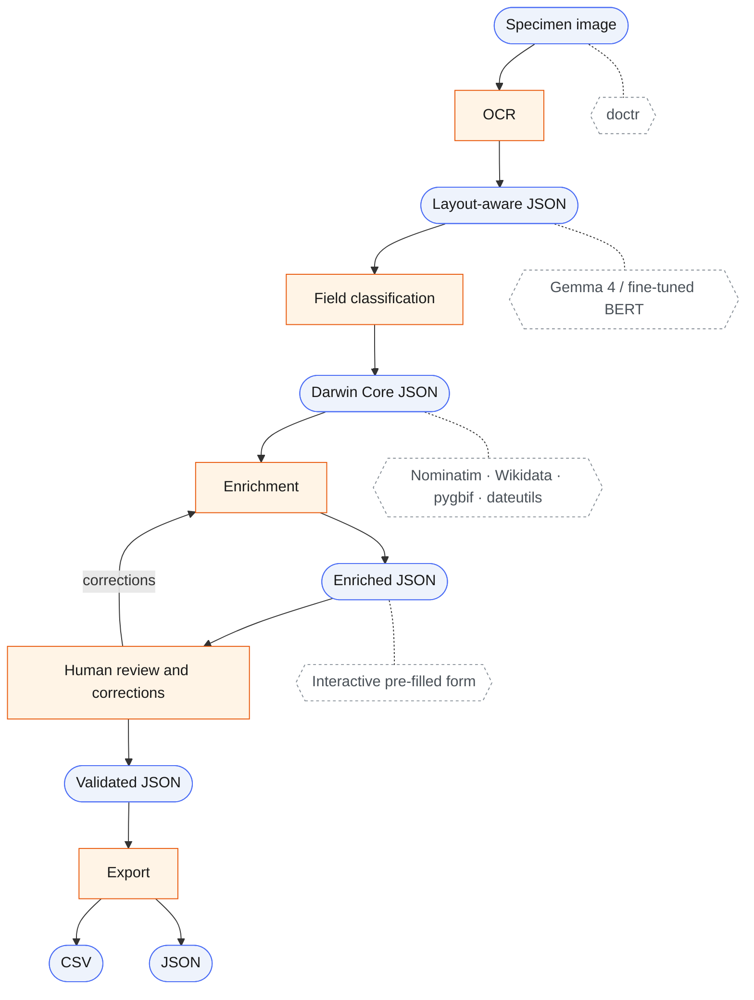

# Pipeline overview

High-level view of what happens when an image goes through speciai.

```mermaid
flowchart TD
    IMG(["Specimen image"])
    LAYOUT(["Layout-aware JSON"])
    DWC(["Darwin Core JSON"])
    ENRICHED(["Enriched JSON"])
    VALID(["Validated JSON"])
    CSV(["CSV"])
    JSONOUT(["JSON"])

    OCR[OCR]
    CLASSIFY[Field classification]
    ENRICH[Enrichment]
    REVIEW[Human review and corrections]
    EXPORT[Export]

    DOCTR{{doctr}}
    GEMMA{{"Gemma 4 / fine-tuned BERT"}}
    ENRICHTECH{{"Nominatim · Wikidata · pygbif · dateutils"}}
    FORM{{"Interactive pre-filled form"}}

    IMG --> OCR --> LAYOUT --> CLASSIFY --> DWC --> ENRICH --> ENRICHED --> REVIEW --> VALID --> EXPORT
    EXPORT --> CSV
    EXPORT --> JSONOUT
    REVIEW -->|corrections| ENRICH

    IMG -.- DOCTR
    LAYOUT -.- GEMMA
    DWC -.- ENRICHTECH
    ENRICHED -.- FORM

    classDef data fill:#eef3fc,stroke:#4c6ef5,color:#1a1a1a;
    classDef proc fill:#fff4e6,stroke:#e8590c,color:#1a1a1a;
    classDef tech fill:none,stroke:#868e96,stroke-dasharray: 3 3,color:#495057;

    class IMG,LAYOUT,DWC,ENRICHED,VALID,CSV,JSONOUT data;
    class OCR,CLASSIFY,ENRICH,REVIEW,EXPORT proc;
    class DOCTR,GEMMA,ENRICHTECH,FORM tech;
```
